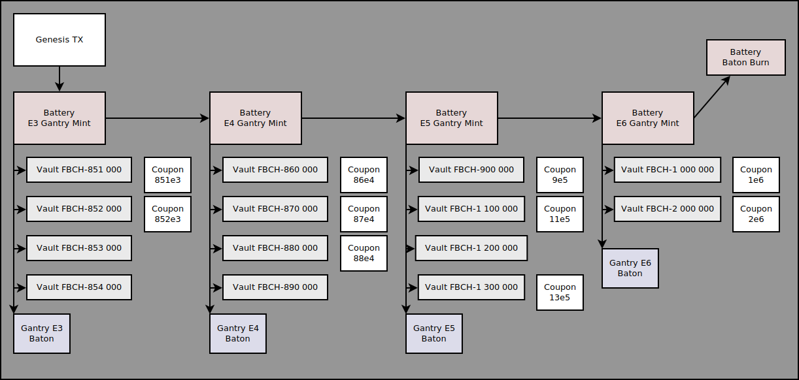
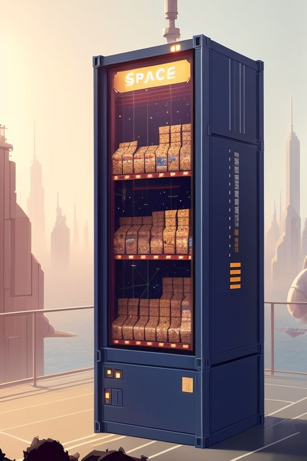

# Future Bitcoin Cash

## Overview

Future Bitcoin Cash is a set of autonomous anyone-can-spend contracts able to mint fungible tokens at regular lock intervals.

Future BCH (FBCH-*) fungible tokens in a particular series may be obtained from a Vault using BCH on a 1:1 basis. FBCH in a series may only be redeemed *after* a required timelock. But tokens that haven't matured can be traded on open markets DeFi supporting fungible CashTokens.

To make things interesting, each Vault can have corresponding coupon contracts to provide incentives for users locking a specific amount. 

Per [CashToken guidelines for token issuers](https://cashtokens.org/docs/bcmr/chip#guidelines-for-token-issuers), each ticker is four letters, all upper case, separated by a hyphen and the locktime expressed as an eight character with zero padding: 
  
  `FBCH-00950000` tokens redeemable after block  950,000 (May '26)

  `FBCH-02000000` tokens redeemable after block 2e6 (2047)

*FBCH* is a collective reference of all series of fungible Future Bitcoin Cash tokens taken together. There is a set of FBCH NFTs used to track the issuance of Futures series, but these utility tokens are held (or burned) exclusively by contracts and will never be offered for sale. 

## Contracts

Given a particular genesis transaction, a battery contract deploys a set of gantries, each with their own minting baton, with different interval commitments using an NFT baton minted in the genesis transaction.

Gantries are anyone-can-spend contracts to position vaults and issue fungible tokens. Vaults hold BCH deposits backed 1:1 for tokens exchanged. 

Each Gantry can then deploy tokens in vaults, where the entire token supply is proveibly sent to the vault.

Coupons allow anyone to lock some incentive for anyone to spend a minimum amount on some other contract. The locking code is deterministic per a vault and locking amount.

